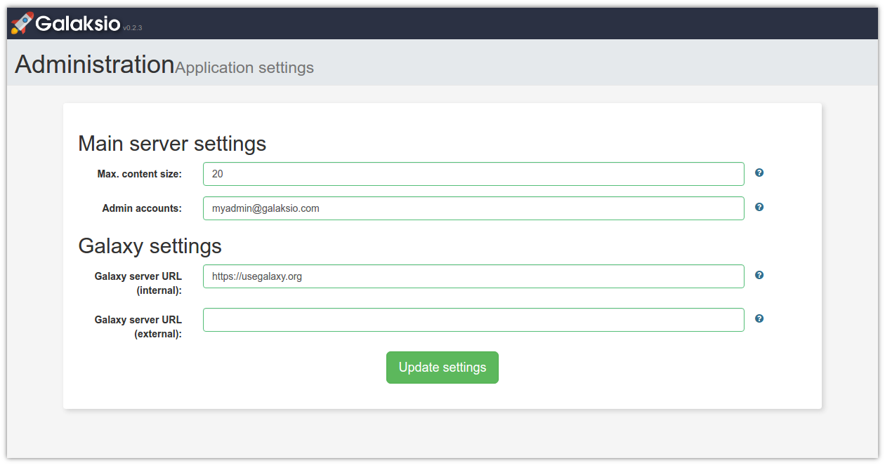
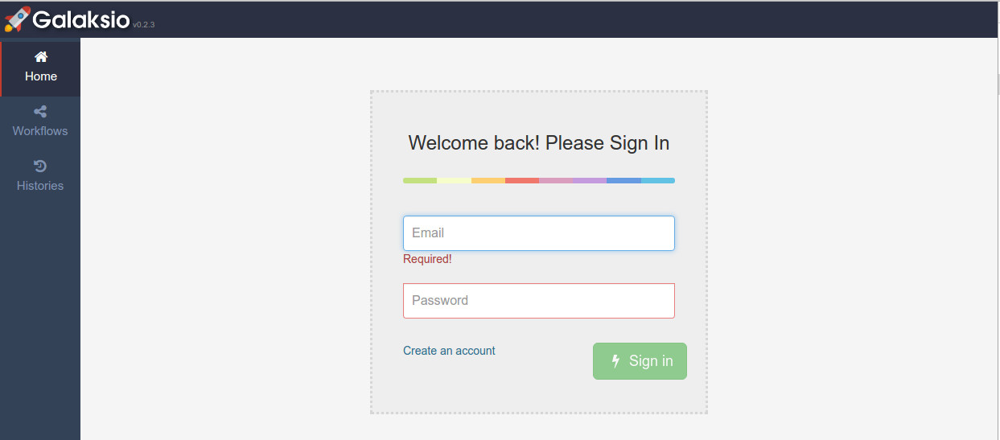

## Galaksio Installation Instructions

* Install the Galaksio application from the BIBBOX store and wait for the logs to stop moving.

* Open up the application by clicking the application tile header in the Applications menu, or the dashboard/logs view.

* If BIBBOX finished the installation of Galaksio in the system, you will see the first setup screen.

    

* Use the following options to set up your new Galaksio instance. Note that this values can be changed later using the _Settings_ panel in the application menu (only administrator accounts).
  * **Max. content size**: The max. accepted size for the requests sent by the clients, in MB. This value mainly determines the max size of the files uploaded to Galaxy.
  * **Admin accounts**: the accounts that have administration rights for the Galaksio application. Use emails separated by commas. All accounts must exists or be created in the associated Galaxy application. New accounts can be created using the Galaksio sign-up form.
  * **Galaxy server URL (internal)**: The internal URL or IP for the Galaxy instance that will receive all the Galaksio requests. If you want to use a Galaxy application running in the BIBBOX, this value should be the docker name for the Galaxy instance (e.g. http://mytest_galaxy). By default the official Galaxy server will be used (http://galaxy_machine)
  * **Galaxy server URL (external)**: The external URL for the Galaxy application, i.e. the real URL that clients use for accessing the Galaxy application. For example, if the internal URL was _"http://mytest_galaxy"_, the external URL could look like _"http://mytest.demobibbox.org"_.

* After some loading time you will be redirected to the _Sign in_ panel and your Galaksio application will be ready to use!

